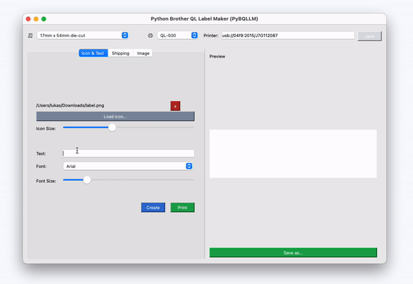

# Python Brother QL Label Maker (PBQLLM)
## Easy to use!
Introducing an easy-to-use label maker for Brother printers, optimized for Mac OS and compatible with Linux. Simplify your labeling process and create professional-grade labels effortlessly.

<div style="text-align:center;">


</div>


## Prerequisites

Before getting started, ensure that you have the following components installed on your system:

- Python 3
- libusb

## Installation and Setup

To begin using PBQLLM, follow these steps:

Clone the PBQLLM repository to your local machine:

``` bash
cd ~
git clone https://github.com/lukasloetkolben/py_brother_ql_label_maker.git

cd py_brother_ql_label_maker
```

Launch PBQLLM by running:

``` bash
./pqllm
```

If a Python 3 virtual environment doesn't exist, it will be automatically created.
All necessary dependencies will be installed, and the program will start!

### Manual installation (Alternatively)
Alternatively, you can install the dependencies globally by running:

``` bash
pip3 install -r requirements.txt
python3 run.py
```

## Get Started with PBQLLM

With PBQLLM successfully set up, you can now easily create labels for your Brother QL Label Printer.

Feel free to explore the features and functionalities provided by PBQLLM. If you encounter any issues or need guidance,
refer to the repository's documentation or seek assistance from the supportive community.

Happy labeling!